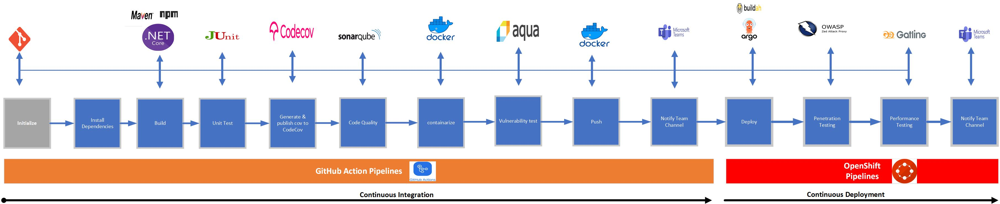

# Adopting DevSecOps

The purpose and intent of DevSecOps are to build on the mindset that “everyone is responsible for security” to safely distribute security decisions at speed and scale to those who hold the highest level of context without sacrificing the safety required. – Shannon Lietz
DevSecOps talks about responsibility for security and moves away from the concept of a dedicated security team that handles all the security requirements. It mentions that everyone is responsible for security. It also mentions moving the decision-making process to those who can use all the contextual information that they have at their disposal to make the right decision. It is not the security team that makes all the decisions, it is those who are placed in the best context to make the decision, at the end we do not want to sacrifice the safety of the system.

## DevSecOps

DevSecOps CICD pipeline using several technologies such as:

- [Openshift Pipelines](https://www.openshift.com/learn/topics/ci-cd)
- [Openshift GitOps](https://www.openshift.com/blog/announcing-openshift-gitops)
- [AquaSec Security for Kubernetes](https://github.com/marketplace/actions/aqua-security-trivy)
- [Openshift Container Registry](https://docs.openshift.com/container-platform/latest/registry/architecture-component-imageregistry.html)

This pipeline also improve security adding:

* Static application security testing (SAST), which analyzes code under development for vulnerabilities and quality issues.

- [SonarQube](https://www.sonarqube.org/)
- [JUnit](https://junit.org/junit5/)
- [Git Webhook](https://tekton.dev/docs/triggers/)
- [Gatling](https://gatling.io/)
- [Zap Proxy](https://www.zaproxy.org/)

# Overview

## 1. Continuous Integration

On every push to the source git repository on git server, the above steps are executed within the Github Action and Tekton pipeline:

## GitHiub Actions

0. [Code is cloned](docs/Steps.md#source-clone) from git server and the unit-tests are run
1. [Install Dependency](docs/Steps.md#dependency-report) Install required dependencies to build and test the app
2. [Unit tests](docs/Steps.md#unit-tests) are executed and in parallel the code is [analyzed by Sonarqube](docs/Steps.md#code-analysis-sonarqube) for anti-patterns.
3. [Generate and Publish code coverage] to project codecov repo (https://app.codecov.io/gh)
4. A [container image is built](docs/Steps.md#build-image) in DEV environment using S2I
5. [Scan built image] with AquaSec (https://github.com/marketplace/actions/aqua-security-trivy)
6. pushed to OpenShift internal registry, and tagged with APP-NAME:[branch] for TEST and APP-NAME:latest for DEV and APP-NAME:[Release_version] for PROD
7. Use teams webhook to notify project teams member of CI status

## 3. Continuous Delivery

## ArgoCD

Argo CD continuously monitor the configurations stored in the Git repository and uses Kustomize to overlay environment specific configurations when deploying the application to DEV and STAGE environments.

8. The ArgoCD applications syncs the manifests in our gogs git repositories, and applies the changes automatically into the namespaces defined:

and deploys every manifest that is defined in the branch/repo of our application:

## 4. PostCI - Pentesting and Performance Tests

Once the application is deployed, we need to ensure of our application is stable and performant and also that nobody can hack our application easily.

9. Our CD in Openshift Pipelines [waits until the ArgoCD app is fully sync](docs/Steps.md#wait-application) and our app and all the resources are deployed
10. The [performance tests are cloned](docs/Steps.md#performance-tests-clone) into our pipeline workspace
11. The [pentesting is executed](docs/Steps.md#pentesting-tests-using-zap-proxy) using the web scanner [OWASP Zap Proxy](https://www.zaproxy.org) using a baseline in order to check the possible vulnerabilities, and a Zap Proxy report is uploaded to the report server repository.
12. In parallel the [performance tests are executed](docs/Steps.md#performance-tests-using-gatling) using the load test [Gatling](https://gatling.io/) and a performance report is uploaded to the report server repository.

## 5. Notifications

Use Teams Webhook to notify project teams

