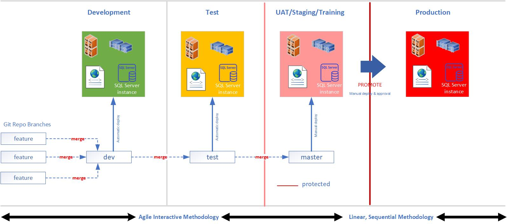

## Adopting DevSecOps

Agile methodology, the slides of works are released more frequently even though the volume of work is smaller, it releases values sooner to the stakeholder. This means that the stakeholder has the option to make modifications early in the process but also provides a tremendous feedback loop to the stakeholder group earlier than the Waterfall methodology

Create a release tag at every merge to the master branch.